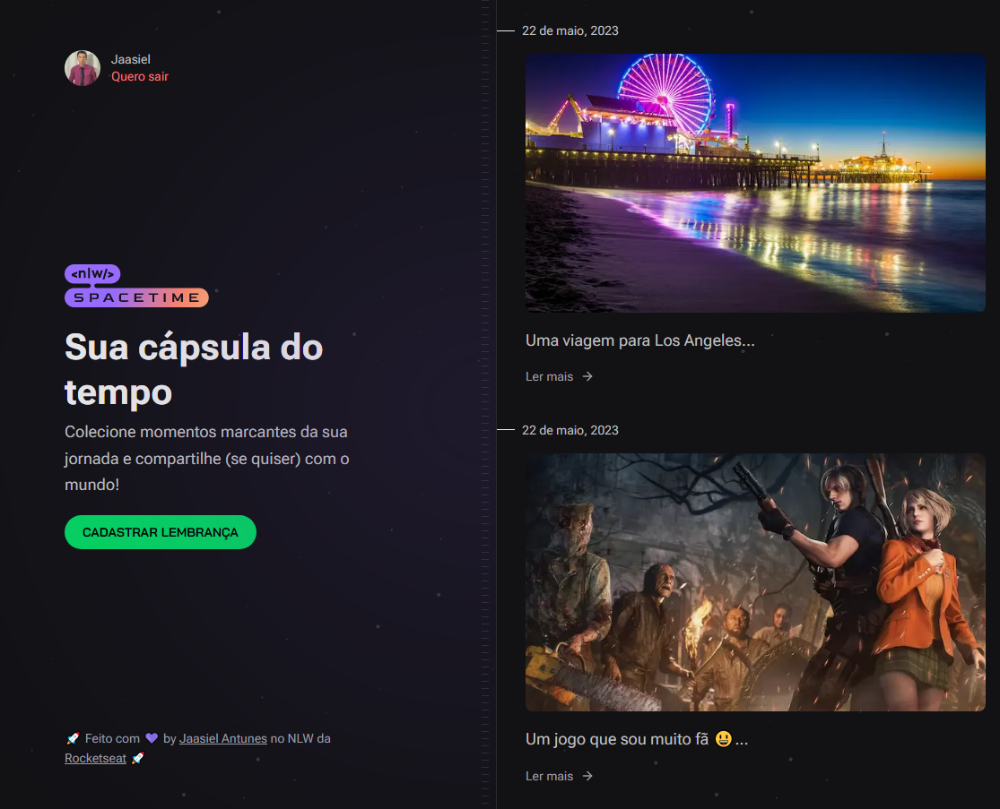
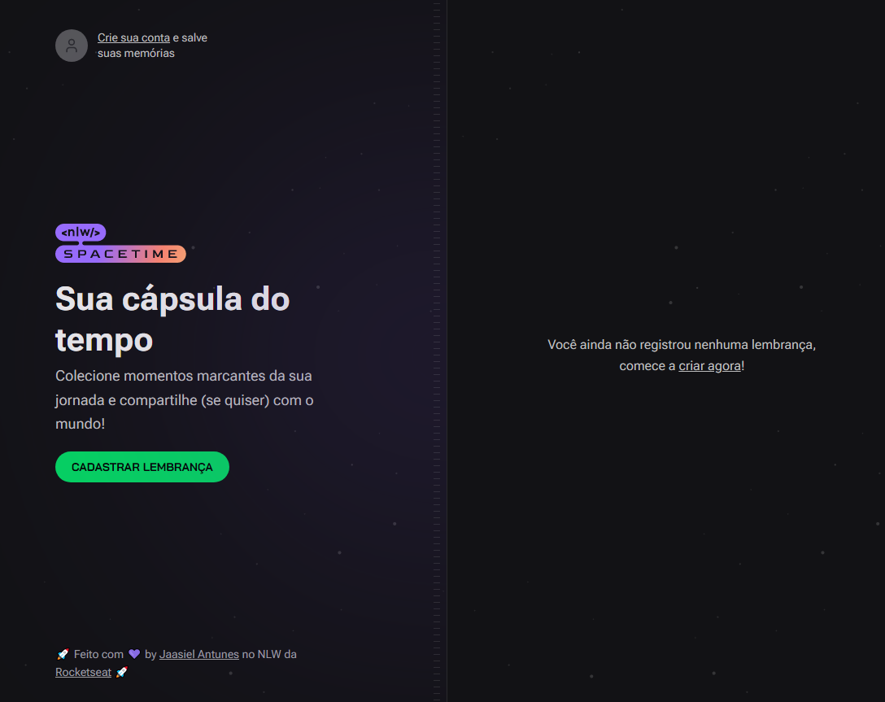
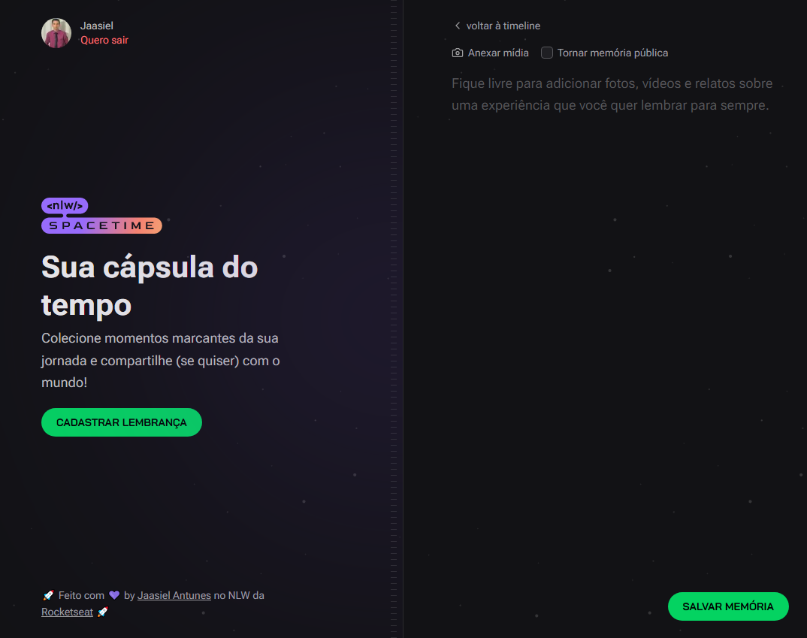

# Spacetime Frontend <br>
[](https://github.com/JaasielAntunes/nlw-spacetime-frontend/blob/main/LICENSE)
<br> <br>

# Sobre o projeto:
Parte Web da aplicação Spacetime que foi desenvolvida durante o NLW 12 (trilha ignite) promovido pela [Rocketseat](https://rocketseat.com.br "Site da Rocketseat").
<br> <br>

A aplicação tem como objetivo guardar recordações de eventos importantes que acontecerão na vida do usuário onde o mesmo realiza login com autenticação via Github
sendo necessário ter uma conta na plataforma para poder realizar o login no Spacetime. A aplicação é multiplataforma, ou seja, Web e Mobile.
<br> <br>

## :hammer_and_wrench: Tecnologias utilizadas:
* Frontend
  * __React__ + __Next__ + __Typescript__
  * __TailwindCSS__ para estilização
  * __Lucide-React__ para ícones
  * __JWT_Decode__ para obter o token
<br> <br>

## :car: Iniciando a aplicação:
Baixe o repositório com git clone e entre na pasta do projeto.
```bash
$ git clone https://github.com/JaasielAntunes/nlw-spacetime-frontend
```
* Front-end
  * Crie um arquivo .env.local
  * Informe o ClientID gerado na sessão OAuth Apps
```bash
$ cd ..
$ cd web
$ npm install
$ npm run dev
```
<br>

## :camera_flash: Screenshots:
<div>
    
    
</div>

<br>

<div>
    
</div>

## :email: Contato:
contato.jaasiel@gmail.com
<br> <br>

## Autor:
Jaasiel Antunes de Araujo
